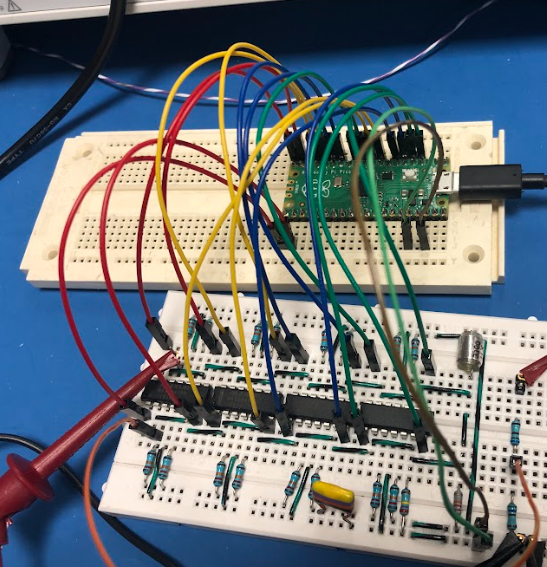

# 16 Channel Design with Comparators
Detects pulses on 16 channels using comparators and the Pico's digital input.

## Compiling Code
Compile the code into a `build/` directory using cmake:
```
mkdir build
cd build
cmake ../ -DPICO_SDK_PATH=../../pico-sdk/
make -j10
```

## Connecting the board


## Using USB or UART
In the cmake file (`CMakeLists.txt`) the standard output (used by the printf functions) can be either set to USB or UART by (un)commenting the relevant lines. When using UART, the UART0 pins (pins 1 and 2) are used.

When using the USB I/O, the Pico should appear as `/dev/ttyACM0` device file. The data can be read out using the Minicom software:
```
minicom -D /dev/ttyACM0 -b 9600
```
The Pico listens for `\r` (return) symbol, which can be sent by pressing enter within the Minicom software.
